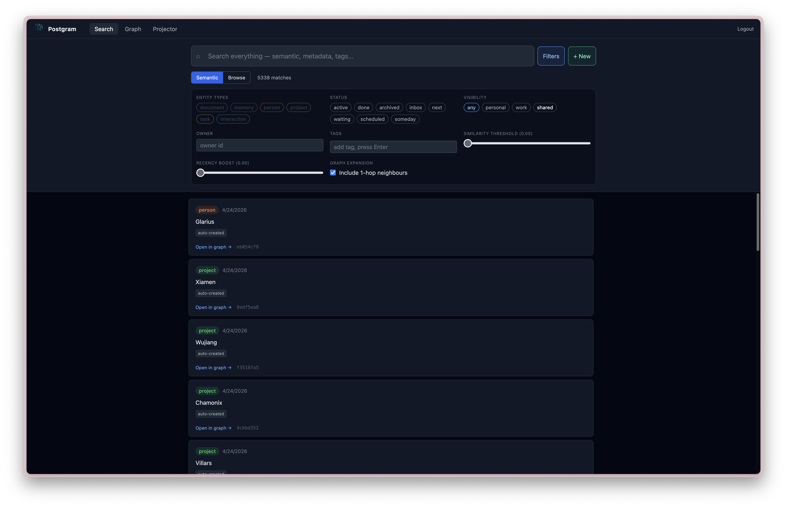
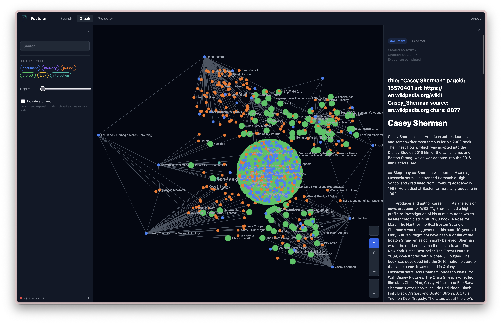
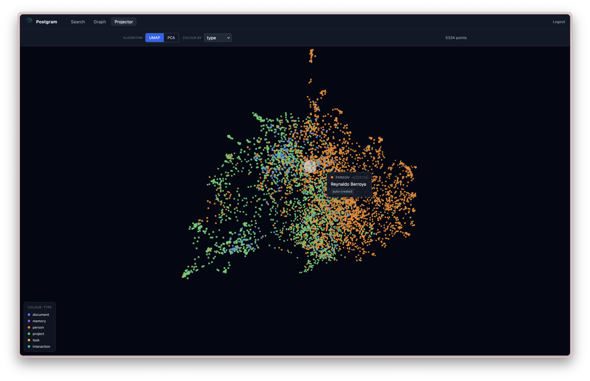

<p align="center">
  
</p>

<h1 align="center">Postgram</h1>

<p align="center">
  <strong>A self-hosted productivity and knowledge backend for humans and AI agents.</strong>
</p>

<p align="center">
  <a href="https://postgram.dev">Website</a> ·
  <a href="https://postgram.dev/getting-started/quick-start/">Quick start</a> ·
  <a href="https://postgram.dev/guides/mcp-integration/">MCP guide</a> ·
  <a href="https://postgram.dev/reference/rest-api/">REST API</a> ·
  <a href="https://www.youtube.com/watch?v=xr7u11gtYgM">Demo</a>
</p>

Postgram keeps the data you and your agents work from in one inspectable place:
notes, documents, tasks, people, projects, interactions, decisions, and agent
memory. Humans use the browser UI and CLI; agents use the same corpus over MCP,
REST, or the CLI.

It is more than an agent-memory layer. Postgram preserves typed source objects,
supports GTD-style task management and Markdown folder sync, combines full-text
and vector retrieval with a knowledge graph, and separates short-lived agent
working context from durable memory.

<table>
  <tr>
    <td width="50%">
      <a href="https://www.youtube.com/watch?v=xr7u11gtYgM">
        
      </a>
      <br />
      <sub>Watch the demo</sub>
    </td>
    <td width="50%">
      
      <br />
      <sub>Search across memories, documents, people, projects, and tasks</sub>
    </td>
  </tr>
</table>

## Why Postgram

- **One private corpus across tools.** Give different agents and devices access
  to the same data without tying it to one editor or hosted memory provider.
- **Inspectable source data.** Store typed entities instead of opaque chat
  summaries, then search, edit, link, archive, or delete them yourself.
- **Search before graph expansion.** Hybrid retrieval finds relevant entities;
  edge summaries tell an agent when related graph context is worth following.
- **Working context is not durable memory.** Session context has its own scope
  and lifecycle; grooming can archive it or distill selected context into
  durable memory.
- **Operator control.** Choose where PostgreSQL runs, which embedding and
  extraction providers are allowed, who receives API keys, and what is kept.

Postgram is built for one person or a small trusted team running a local or
single-VM deployment. It is not a hosted service or a multi-tenant SaaS
platform. Knowledge extraction is optional, and the provided Docker Compose
setup binds the raw API and UI ports to loopback by default.

## Quick Start (Docker Compose)

You need Git, Docker, and Docker Compose. Node.js 22+ is needed only for local
development or for installing the `pgm` CLI; `gpg` is needed only for encrypted
CLI backups.

1. Clone Postgram:

   ```bash
   git clone https://github.com/ivo-toby/postgram.git
   cd postgram
   ```

2. Choose an embedding path before the first start. For the local default,
   install and start Ollama on the Docker host, then pull Postgram's default
   embedding model:

   ```bash
   ollama pull bge-m3
   ```

   For hosted OpenAI embeddings instead, create a `.env` file containing a real
   key before starting Compose:

   ```dotenv
   OPENAI_API_KEY=<your-openai-key>
   ```

3. Start the stack:

   ```bash
   docker compose up -d --build
   ```

   The first run creates persistent Docker volumes for PostgreSQL and
   installation secrets. No `.env` file is required for the default Compose
   path.

4. Read the one-time bootstrap token:

   ```bash
   docker compose logs mcp-server \
     | grep 'Bootstrap token:' \
     | tail -n 1
   ```

   The plaintext appears only in the original first-start logs. Capture it
   before recreating the API container or discarding those logs.

5. Open [http://127.0.0.1:3000/admin](http://127.0.0.1:3000/admin), paste the
   token, create the first admin, enroll MFA, and follow the onboarding flow.

6. Confirm the selected provider in the Admin **Config** tab. If you add or
   change staged settings, save, validate, and apply them, then restart
   `mcp-server` when Admin marks a restart as required:

   ```bash
   docker compose restart mcp-server
   ```

   When Ollama runs on the Docker host, its base URL is
   `http://host.docker.internal:11434`. Optional LLM relationship extraction is
   disabled by default and can use OpenAI, Anthropic, Ollama, or an
   OpenAI-compatible endpoint. Changing the embedding provider, model, or
   dimensions after the first start is migration work and is blocked from a
   simple config apply.

7. Check health, then create an API key in the Admin **Overview** tab. For the
   smoke test below, allow `read` and `write`, the `memory` entity type, and
   `personal` visibility:

   ```bash
   curl -fsS http://127.0.0.1:3100/health
   ```

   The response should include `"status":"ok"` and
   `"postgres":"connected"`.

8. Install the CLI and verify an authenticated write and search. Enrichment is
   asynchronous, so wait for `pgm queue` to report no pending work before the
   search:

   ```bash
   npm install -g @ivotoby/postgram-cli
   export PGM_API_URL=http://127.0.0.1:3100
   export PGM_API_KEY='<plaintext-api-key>'

   pgm store "Postgram quick start is working" \
     --type memory \
     --visibility personal \
     --tags quickstart
   pgm queue
   pgm search "quick start"
   ```

If embeddings are unreachable, Postgram still starts and accepts writes, but
enrichment and search will fail until the provider is available. See the
[full quick start](https://postgram.dev/getting-started/quick-start/) and
[troubleshooting guide](https://postgram.dev/operations/troubleshooting/) for
the longer path.

For access from ChatGPT, Claude, or another remote MCP client, put Postgram
behind HTTPS, enable OAuth, and follow the
[MCP integration guide](https://postgram.dev/guides/mcp-integration/). Do not
publish the loopback development ports directly to the internet.

## What It Does

Postgram provides:

- durable storage for typed entities: `memory`, `person`, `project`, `task`,
  `interaction`, `document`
- hybrid BM25 + vector search with asynchronous enrichment
- knowledge graph with typed directional edges between entities
- LLM-powered relationship extraction (OpenAI, Anthropic, or Ollama)
- document sync from local markdown repos via manifest comparison
- browser interfaces for knowledge work and guarded administration
- UMAP and PCA projections of embedded entities
- GTD-style capture, task organization, and Kanban views
- scoped API-key authentication and visibility restrictions
- a REST API for application and automation access
- a Streamable HTTP MCP endpoint for agent-native tool access
- a CLI (`pgm`) for humans and agents
- a container-local admin CLI (`pgm-admin`)
- Talon SQLite migration tooling
- encrypted backup support
- audit logging for mutating and privileged operations

## How It Works

Postgram is a TypeScript Node.js application built around a service layer.

Main components:

- PostgreSQL + `pgvector` for persistence and vector search
- Hono for the HTTP server
- MCP over Streamable HTTP for agent-facing tool access
- CLI/admin CLIs built with Commander
- background enrichment worker for chunking, embeddings, and LLM extraction

High-level flow:

1. a client stores or updates an entity
2. the entity is written immediately
3. enrichment runs asynchronously: chunking, embedding, and optionally LLM extraction
4. chunks and embeddings are produced in the background
5. edges are created from extracted relationships (if extraction is enabled)
6. search queries use hybrid BM25 + vector scoring, with optional graph expansion

## Main Features

### 1. Typed Knowledge Storage

Store structured knowledge objects with:

- `type` (memory, person, project, task, interaction, document)
- `content`
- `tags`
- `visibility` (personal, work, shared)
- `status`
- arbitrary JSON metadata

### Memory Roles

Postgram supports two roles for `memory` entities:

- `durable_memory`: long-term memory future agents should trust, such as decisions, preferences, constraints, root causes, and completed-work summaries.
- `session_context`: working context for resuming recent conversations. Session context is scoped to the calling client, embedded for semantic recall, and skipped by graph extraction.

Use session context for "where were we in this thread?" Use durable memory for "what should future agents remember as true?"

CLI users can write session context with `pgm memory session-context` and search
it with `pgm search --memory-role session_context`.

Operators can groom stale session context with `pgm-admin memory groom`.
Use `--client-id <client-id>` for one client or `--all-clients` to batch over
every session-context scope. `--all-clients` keeps each client scope separate;
it is operational batching, not cross-client consolidation.
`--older-than <duration>` defaults to `7d` and accepts values like `30m`,
`4h`, `7d`, or `0d`. `--dry-run` previews eligible memories without calling
the LLM. Grooming has no default candidate cap; pass `--limit <n>` when you
want to process a bounded batch.
`--mode archive --yes` archives eligible working context directly.
`--mode promote --yes` uses the configured extraction LLM to decide whether
each session-context memory should be promoted; promoted memories are distilled
into new `durable_memory` entities, the source context is archived, and
provenance is recorded with `metadata.promoted_to` plus a `promoted_to` edge.

Authenticated users and agents can self-groom only their own client-scoped
session context:

```bash
pgm memory groom --dry-run --older-than 7d
pgm memory groom --older-than 14d --topic postgram --tag session-context --yes
```

The normal CLI derives scope from `PGM_API_KEY`; it does not accept
`--client-id`, `--all-clients`, or promotion mode. Archive requires `--yes`.
Optional filters are `--topic`, `--session-id`, and repeatable `--tag`.

MCP clients can use the `groom_session_context` tool with the same self scope:

```json
{
  "mode": "dry_run",
  "older_than": "7d",
  "topic": "postgram",
  "session_id": "optional-session-id",
  "tags": ["session-context"]
}
```

MCP `mode` is `dry_run` or `archive`; promotion remains admin-only.

For scheduled maintenance, run grooming from the host that has access to the
Postgram container. This cron example assesses eligible session context for all
client scopes every three days at 03:17 and appends JSON output to a log. The
wrapper detects that cron does not provide a TTY and runs non-interactively:

```cron
17 3 */3 * * cd /path/to/postgram && ./bin/pgm-admin --json memory groom --all-clients --older-than 7d --mode promote --yes >> /var/log/postgram-memory-groom.log 2>&1
```

Use `--mode archive --yes` instead if you want to archive eligible working
context without LLM-assisted promotion. Run the same command with `--dry-run`
first to verify the eligible set.

Operators can also review durable memory quality without mutating the durable
claim itself:

```bash
./bin/pgm-admin memory groom-durable --dry-run --older-than 30d
./bin/pgm-admin memory groom-durable --mode mark --yes --older-than 30d
```

Durable grooming selects active `durable_memory` rows, including legacy memory
rows with no `metadata.memory_role`, and classifies them as `keep`,
`needs_grooming`, `archive`, or `superseded`. Mark mode writes
`metadata.durable_grooming` with the outcome, reason, review timestamp, and any
LLM suggestions. It does not rewrite content, change status, archive rows, or
merge duplicates.

To actually clean the marked rows, apply the grooming labels:

```bash
./bin/pgm-admin memory apply-durable-grooming --dry-run
./bin/pgm-admin memory apply-durable-grooming --yes
```

Apply mode defaults to `auto`: `needs_grooming` memories are rewritten from the
stored suggestion or the configured extraction LLM, while `archive` and
`superseded` memories are archived. Rewrites clear stale chunks and re-queue
embedding enrichment. Use `--mode rewrite` or `--mode archive`, plus
`--status`, `--topic`, `--tag`, `--visibility`, or `--limit`, to narrow the
batch.

### 2. Async Enrichment

Entities with content are persisted first and enriched later. Each entity
tracks `enrichment_status`: `pending`, `completed`, or `failed`. Failed
entities are retried up to 3 times with a 5-minute backoff.

### 3. Hybrid Search

Search blends vector cosine similarity (60%) with BM25 keyword ranking (40%)
transparently. Search requires a reachable embedding provider; if that provider
is unavailable, writes still succeed but enrichment and search fail until it
recovers. Results include:

- ranked results with blended scores
- similarity scores
- recency-adjusted scores
- matching chunk text
- optional 1-hop graph neighbors (`expand_graph` parameter)

<p align="center">
  
</p>

### 4. Knowledge Graph

Entities can be connected by typed directional edges:

- relation types: `involves`, `assigned_to`, `part_of`, `blocked_by`,
  `mentioned_in`, `related_to`, or any custom type
- edges have a confidence score (1.0 for manual, LLM-assigned for extracted)
- graph traversal via `expand` with configurable depth (1-3 hops)
- duplicate edge prevention via `UNIQUE(source_id, target_id, relation)`
- edges are created manually via `link`/`unlink` or automatically by the
  LLM extraction pipeline

<p align="center">
  
</p>

### 5. LLM Extraction

When enabled, the enrichment worker extracts relationships from entity content
using an LLM. Extracted entity names are matched against existing entities and
edges are created automatically.

Supported providers:

| Provider  | Model default               | Env vars required                                     |
| --------- | --------------------------- | ----------------------------------------------------- |
| OpenAI    | `gpt-4o-mini`               | `OPENAI_API_KEY`                                      |
| Anthropic | `claude-haiku-4-5-20251001` | `ANTHROPIC_API_KEY`                                   |
| Ollama    | `llama3.2`                  | `OLLAMA_BASE_URL` (default: `http://localhost:11434`) |

These are configuration defaults, not model-quality recommendations. Graph
extraction is a constrained structured-output task; validate the resulting
edges on your own corpus before running a large backfill, especially with small
local models.

<p align="center">
  
</p>

### 6. Document Sync

Sync local directories of markdown files into postgram:

```bash
pgm sync ~/Documents/personal-notes
pgm sync ~/Documents/cf-notes --repo cf-notes --quiet
```

The CLI walks the directory for `.md` files, computes SHA-256 hashes, and sends
a full manifest to the server. The server diffs against stored state and
creates, updates, or archives document entities. Supports `--dry-run` and cron
scheduling.

### 7. Access Control

API keys can be restricted by:

- scopes: `read`, `write`, `delete`, `sync`
- allowed entity types
- allowed visibility levels

### 8. Task Management

Tasks are first-class entities with convenience operations for:

- create (with GTD context and due dates)
- list (filtered by status and context)
- update
- complete (with completion timestamp)

### 9. Multiple Interfaces

The same service layer is exposed through:

- REST API
- Streamable HTTP MCP endpoint
- `pgm` CLI
- `pgm-admin` CLI (`./bin/pgm-admin`)
- Browser extensions for [Chrome](./packages/browser-extension-chrome) and
  [Firefox](./packages/browser-extension-firefox) — one-click web clipper
  that captures the current page or text selection via the REST API.
  Build with `npm run -w @ivotoby/postgram-browser-extension-chrome package`
  (or the Firefox equivalent); install unpacked from the per-package
  README.

## Repository Layout

```text
src/
  auth/            API key validation and auth middleware
  cli/             CLI for humans/agents and admin CLI
  db/              Pool and migrations
  migrate-talon/   Talon import path
  services/        Business logic (entities, search, edges, sync, extraction)
  transport/       REST and MCP adapters
  types/           Shared types
  util/            Errors, audit, logging

ui/                User-facing web UI and Admin UI
cli/               Published @ivotoby/postgram-cli package
docker/            Container entrypoint and secret bootstrap scripts
bin/               Local operator wrappers

packages/
  browser-extension-chrome/   Chromium web clipper (MV3)
  browser-extension-firefox/  Firefox web clipper (MV3)

tests/
  contract/        REST and MCP contract tests
  integration/     Service and CLI integration tests
  unit/            Pure logic tests
```

## Requirements

- Docker and Docker Compose for the recommended deployment
- Node.js 22+ for the `pgm` CLI or local development
- a reachable OpenAI or Ollama embedding provider for enrichment and search

Optional:

- OpenAI API key (for OpenAI embeddings or extraction)
- Anthropic API key (for LLM extraction)
- Ollama (for local embeddings or LLM extraction)
- `gpg` (for encrypted CLI backups)

## Docker Setup Details

### 1. Start Docker Compose

```bash
docker compose up -d --build
```

The default Compose path does not require manual `.env` edits. On first run it
creates a persistent `postgram_secrets` Docker volume containing:

- the Postgres password used by the app container
- `ADMIN_MFA_SECRET_KEY` for encrypted admin TOTP seeds
- `ADMIN_SETTINGS_ENCRYPTION_KEY` for DB-backed provider secrets

If an existing Docker install already has `POSTGRES_PASSWORD` in `.env`, the
first start after this change copies that legacy password into
`postgram_secrets/postgres-password` instead of generating a different database
password. Keep the old `.env` value in place for that first upgraded start.

The API binds to `127.0.0.1:3100` and the UI binds to `127.0.0.1:3000` by
default. Use `POSTGRAM_API_PORT=<port>` or `UI_PORT=<port>` as shell overrides
when running more than one local stack.

To use an existing Postgres cluster with Compose, set `POSTGRES_HOST`,
`POSTGRES_PORT`, `POSTGRES_DB`, and `POSTGRES_USER` on `mcp-server` in a Compose
override and remove the `postgres` dependency, as in the operator examples. If
that external cluster requires password auth, set `POSTGRES_PASSWORD` in `.env`;
if it uses passwordless local auth, leave `POSTGRES_PASSWORD=` blank. You can
also bypass the split settings entirely by setting `DATABASE_URL`.

For embeddings, Compose preserves the OpenAI default when `OPENAI_API_KEY` is
present. If no OpenAI key and no explicit `EMBEDDING_PROVIDER` are supplied, the
container entrypoint chooses local Ollama embeddings so a clean stack can boot
before provider secrets are configured.

### 2. Complete first admin setup

On first start, the API container prints a clear one-time bootstrap banner with
the token:

```text
Postgram first admin setup
Bootstrap token: ...
Open http://127.0.0.1:3000/admin and paste this token.
```

If the console has scrolled, read the same one-time bootstrap token from the
trusted local operator channel:

```bash
docker compose logs mcp-server | grep 'Bootstrap token:' | tail -n 1
```

Then open `http://127.0.0.1:3000/admin`, create the first admin user, and
complete MFA enrollment. The bootstrap token is stored hash-only in Postgres,
expires after 24 hours, and is invalidated after the first admin is created.
If you changed the Postgres target, copy the latest bootstrap-token log line;
older lines may belong to a previous database and will be rejected.

After active MFA login, the Admin dashboard opens a guided onboarding flow until
it is completed or deliberately skipped. The guide explains the setup path in
plain operator language:

- what bootstrap, admin login, and MFA confirmation protect
- how provider settings, embedding dimensions, extraction models, and
  write-only provider secrets fit together
- when to validate and apply saved provider configuration
- why backup/restore is staged before switch-over
- how maintenance dry-runs, re-extraction, re-embedding, and edge pruning work

Onboarding progress is stored server-side in Postgres. Refreshing the browser,
closing the tab, logging out and back in, or restarting the Docker containers
resumes at the latest saved step as long as the existing `pgdata` volume is
preserved. The Onboarding tab remains available from the dashboard after skip
or completion.

For local Docker testing, preserve the database volume:

```bash
docker compose up -d --build
docker compose restart mcp-server postgram-ui
```

Do not use `docker compose down -v` when testing onboarding resume behavior.
That command removes named volumes, including the `pgdata` Postgres volume, and
will reset the server-side onboarding state along with the database.

### 3. Check health

```bash
curl http://127.0.0.1:3100/health
```

Expected:

- `status: "ok"`
- `postgres: "connected"`

### 4. Configure providers and create API keys

Use the Admin dashboard in the browser for the supported happy path:

- Onboarding tab: resume, skip, or complete the Docker-first setup guide.
- Config tab: save provider settings and write-only provider secrets.
- Overview tab: create Postgram API keys, inspect health, queue, stats,
  config/model/job status, and audit rows.
- Maintenance tab: run safe dry-run previews and poll job status before any
  destructive apply.
- Backup tab: download a gzipped v2 archive containing a data-only PostgreSQL
  custom dump plus redacted runtime configuration. Restore is intentionally
  staged: the server rejects legacy v1/full-schema archives, accepts only
  approved Postgram table-data entries from `pg_restore --list`, creates the
  trusted schema from bundled migrations, and restores the accepted data into
  a new database name. Health checks run before operator-approved switch-over.
  If the restored database misbehaves, roll back by restoring the previous
  `POSTGRES_DB` or `DATABASE_URL` setting and restarting
  `mcp-server`/`postgram-ui`; the old database is left untouched for this
  emergency path.

Normal Docker setup and maintenance should not require `pgm-admin` after
startup/bootstrap. The `pgm-admin` CLI remains documented below for emergency
recovery, embedding migrations, raw SQL inspection, and advanced operator
jobs.

### Docker Secret Backup And Failure Behavior

Back up the `postgram_secrets` Docker volume separately from database backups.
Database backups contain encrypted provider secrets and encrypted TOTP factors;
they do not contain the installation keys needed to decrypt them.

Losing or replacing `ADMIN_MFA_SECRET_KEY` prevents existing TOTP factors from
being verified. Losing or replacing `ADMIN_SETTINGS_ENCRYPTION_KEY` prevents
stored provider secrets from being decrypted. With the wrong settings key,
provider config reads remain redacted, provider apply/runtime secret use fails
closed, and operators must restore the original key or re-save provider
secrets after a deliberate rotation/recovery procedure.

For Docker Compose, missing secret files are generated only on an empty
`postgram_secrets` volume. Invalid persisted secret files fail container
startup before the server binds. Optional env overrides still work, but keep
those values outside database backups and browser storage.

## Environment Variables

### Server

| Variable                      | Required    | Default | Description                                                                                                                    |
| ----------------------------- | ----------- | ------- | ------------------------------------------------------------------------------------------------------------------------------ |
| `DATABASE_URL`                | non-Compose | Docker secret file + Postgres env | Full Postgres connection string. Compose constructs it from the generated Postgres password secret when unset.                 |
| `POSTGRES_HOST`               | no          | `postgres` | Compose Postgres host used when `DATABASE_URL` is unset. Override to `host.docker.internal` or another hostname for an existing cluster. |
| `POSTGRES_PORT`               | no          | `5432`  | Compose Postgres port used when `DATABASE_URL` is unset.                                                                        |
| `POSTGRES_DB`                 | no          | `postgram` | Compose Postgres database used when `DATABASE_URL` is unset.                                                                    |
| `POSTGRES_USER`               | no          | `postgram` | Compose Postgres user used when `DATABASE_URL` is unset.                                                                        |
| `POSTGRES_PASSWORD`           | no          | Docker secret file | Compose Postgres password used when `DATABASE_URL` is unset. For external hosts, an explicit blank value builds a passwordless URL. |
| `ADMIN_MFA_SECRET_KEY`        | admin setup | Docker secret file | Stable 32+ character secret used to encrypt admin TOTP seeds. Compose generates and persists it in `postgram_secrets` when unset. |
| `OPENAI_API_KEY`              | conditional |         | Required when `EMBEDDING_PROVIDER=openai` OR (`EXTRACTION_ENABLED=true` AND `EXTRACTION_PROVIDER=openai`). Optional otherwise. |
| `ADMIN_SETTINGS_ENCRYPTION_KEY` | when saving admin-managed secrets | Docker secret file | 32-byte base64url installation key used to encrypt DB-backed provider secrets. Compose generates and persists it in `postgram_secrets` when unset. Keep it outside database backups. |
| `PORT`                        | no          | `3100`  | HTTP/MCP server port                                                                                                           |
| `POSTGRAM_API_PORT`           | no          | `3100`  | Docker Compose host port for the API/backend. The container listen port stays `3100`.                                          |
| `UI_PORT`                     | no          | `3000`  | Docker Compose host port for the UI.                                                                                           |
| `OAUTH_ENABLED`               | no          | `false` | Enable OAuth authorization-code, PKCE, and Dynamic Client Registration routes for native remote MCP connectors.                 |
| `PUBLIC_BASE_URL`             | conditional |         | Public HTTPS origin for OAuth metadata and callback URLs. Required when `OAUTH_ENABLED=true`. Example: `https://postgram.example.com`. |
| `LOG_LEVEL`                   | no          | `info`  | pino log level                                                                                                                 |
| `ENRICHMENT_POLL_INTERVAL_MS` | no          | `1000`  | Enrichment worker poll interval                                                                                                |

### Embeddings

| Variable               | Required             | Default                         | Description                                                                                                                     |
| ---------------------- | -------------------- | ------------------------------- | ------------------------------------------------------------------------------------------------------------------------------- |
| `EMBEDDING_PROVIDER`   | no                   | `openai` (Compose auto-selects) | `openai` or `ollama`. Compose keeps OpenAI when `OPENAI_API_KEY` is present, otherwise chooses Ollama unless explicitly set. |
| `EMBEDDING_MODEL`      | no                   | per-provider                    | Defaults: `text-embedding-3-small` (openai, 1536 dims), `bge-m3` (ollama, 1024 dims)                                            |
| `EMBEDDING_DIMENSIONS` | no                   | per-provider                    | Must match the active `embedding_models` row. Run `./bin/pgm-admin embeddings migrate --target-dimensions <N> --yes` to change. |
| `EMBEDDING_BASE_URL`   | when provider=ollama | falls back to `OLLAMA_BASE_URL` | Embedding host. Independent from LLM-extraction host so embeddings and inference can target different machines.                 |
| `EMBEDDING_API_KEY`    | no                   |                                 | Optional bearer token for `EMBEDDING_BASE_URL`.                                                                                 |

When Postgram runs in Docker and Ollama runs directly on the Docker host, use `http://host.docker.internal:11434` for `EMBEDDING_BASE_URL`; `localhost` inside the container points at the Postgram container, not the host machine.

See [`specs/002-local-embeddings/quickstart.md`](specs/002-local-embeddings/quickstart.md) for a walkthrough of fresh-install-on-Ollama and migrating from OpenAI.

### LLM Extraction

| Variable                                       | Required                        | Default                      | Description                                                                                                                                                                                                                                                                                                  |
| ---------------------------------------------- | ------------------------------- | ---------------------------- | ------------------------------------------------------------------------------------------------------------------------------------------------------------------------------------------------------------------------------------------------------------------------------------------------------------ |
| `EXTRACTION_ENABLED`                           | no                              | `false`                      | Enable LLM relationship extraction                                                                                                                                                                                                                                                                           |
| `EXTRACTION_MEMORY_MODE`                       | no                              | `embed_only`                 | Controls graph extraction for `type=memory`: `embed_only` keeps all memories searchable through embeddings without graph/entity extraction; `extract_durable` extracts only `durable_memory`; `extract_all` extracts both durable and session-context memories.                                                |
| `EXTRACTION_PROVIDER`                          | no                              | `openai`                     | LLM provider: `openai`, `anthropic`, `ollama`, or `openai-compatible`                                                                                                                                                                                                                                        |
| `EXTRACTION_MODEL`                             | no                              | per-provider                 | Model name (defaults: `gpt-4o-mini` for OpenAI, `claude-haiku-4-5-20251001` for Anthropic, `llama3.2` for Ollama, `gpt-4o-mini` for OpenAI-compatible)                                                                                                                                                       |
| `EXTRACTION_BASE_URL`                          | when provider=openai-compatible |                              | Base URL for OpenAI-compatible chat-completions APIs, including any `/v1` path. Postgram appends `/chat/completions`. Example: `http://host.docker.internal:8000/v1`.                                                                                                                                        |
| `EXTRACTION_API_KEY`                           | no                              |                              | Optional bearer token for `EXTRACTION_BASE_URL`.                                                                                                                                                                                                                                                             |
| `EXTRACTION_AUTO_CREATE_ENTITIES`              | no                              | `false`                      | When true, extraction creates stub entities for referenced targets that don't yet exist (e.g. a person named in a document gets a `person` entity automatically). Tagged `auto-created`; metadata records the originating document.                                                                          |
| `EXTRACTION_AUTO_CREATE_TYPES`                 | no                              | `person,project,interaction` | Comma-separated list of entity types eligible for auto-creation. `document`, `task`, `memory` are intentionally excluded from the default to keep those user-authored.                                                                                                                                       |
| `EXTRACTION_AUTO_CREATE_MIN_CONFIDENCE`        | no                              | `0.7`                        | Minimum per-extraction confidence (0–1) required to auto-create an entity. Raise to cut noise, lower for a denser graph.                                                                                                                                                                                     |
| `ANTHROPIC_API_KEY`                            | when provider=anthropic         |                              | Anthropic API key                                                                                                                                                                                                                                                                                            |
| `OLLAMA_BASE_URL`                              | no                              | `http://localhost:11434`     | Ollama server URL                                                                                                                                                                                                                                                                                            |
| `EXTRACTION_REASONING_EFFORT`                  | no                              | unset                        | `minimal` \| `low` \| `medium` \| `high`. Forwarded as `reasoning_effort` to OpenAI and Ollama for reasoning models (o-series, gpt-5, gpt-oss). When set, overrides the implicit `minimal` that `EXTRACTION_DISABLE_THINKING=true` sends to OpenAI.                                                          |
| `LLM_REQUEST_TIMEOUT_MS`                       | no                              | `120000`                     | Hard cap per LLM call in milliseconds. Bump this when running slow local models (e.g. `gpt-oss:120b-cloud`).                                                                                                                                                                                                 |
| `EXTRACTION_SEMANTIC_NEIGHBORS_ENABLED`        | no                              | `false`                      | Enable semantic neighbor linking (see below).                                                                                                                                                                                                                                                                |
| `EXTRACTION_SEMANTIC_NEIGHBORS_MAX`            | no                              | `10`                         | Maximum number of neighbor edges to create per entity.                                                                                                                                                                                                                                                       |
| `EXTRACTION_SEMANTIC_NEIGHBORS_MIN_SIMILARITY` | no                              | `0.65`                       | Minimum cosine similarity (0–1) for an entity to qualify as a neighbor. Raise to reduce noise; lower if you're finding too few neighbors. The right value depends on your embedding model's similarity distribution — use `./bin/pgm-admin link-neighbors --all --dry-run` to inspect actual scores before tuning. |

**Semantic neighbor linking**: the LLM extraction pass only finds entities that
are explicitly named in the source content. It misses entities that are
thematically related but not cited by name — a weekly kickoff meeting about the
same initiative, a wiki page covering the same strategy, a decision memo about
the same project. When `EXTRACTION_SEMANTIC_NEIGHBORS_ENABLED=true`, a second
pass runs after LLM extraction that queries the knowledge store for entities
whose stored chunk embeddings are cosine-similar to the source entity's own
embeddings, and links them with `related_to`. No extra LLM or embedding API
calls are needed — the source entity's chunks are already stored by the
enrichment step that runs before extraction. Edges created by this pass carry
`source = 'semantic-neighbor'` so they are distinguishable from LLM-extracted
edges. Entities already linked by the LLM pass are excluded to avoid a weaker
`related_to` edge shadowing a stronger-typed edge for the same pair.

**Backfilling and maintaining neighbor edges**: the `./bin/pgm-admin link-neighbors`
command runs the semantic neighbor pass directly — no LLM calls, no extraction
queue, just cosine similarity over stored chunks. Use it to backfill an
existing graph or as a recurring maintenance job after new entities are added.

```bash
# Backfill all enriched entities (safe to re-run — edges are upserted).
./bin/pgm-admin link-neighbors --all

# Only documents:
./bin/pgm-admin link-neighbors --type document

# Single entity:
./bin/pgm-admin link-neighbors --id <uuid>

# Preview what would be linked and at what similarity — no edges created:
./bin/pgm-admin link-neighbors --id <uuid> --dry-run
./bin/pgm-admin link-neighbors --all --dry-run

# Tune the similarity threshold or edge cap:
./bin/pgm-admin link-neighbors --all --min-similarity 0.75 --max-neighbors 5

# Process in bounded batches (oldest-first):
./bin/pgm-admin link-neighbors --all --limit 500
```

Use `--dry-run` to inspect actual cosine similarity scores before committing edges — especially useful when tuning `--min-similarity` for a new embedding model. The output shows each entity and its candidate neighbors with their raw similarity scores.

If you also want to re-run LLM extraction at the same time (e.g. after enabling
`EXTRACTION_SEMANTIC_NEIGHBORS_ENABLED=true`), use `reextract` instead — the
worker runs both the LLM pass and the neighbor pass together:

```bash
./bin/pgm-admin reextract --all
```

Note: `--clean-edges` on `reextract` only removes edges with
`source='llm-extraction'` — it does not touch `semantic-neighbor` edges. For a
full clean slate:

```sql
DELETE FROM edges WHERE source = 'semantic-neighbor';
```

**Scheduling as a recurring maintenance job**: because `link-neighbors` is
cheap (no LLM calls) and idempotent (edges are upserted, not duplicated), it
works well as a weekly cron job that keeps the neighbor graph fresh as new
entities are added. Example cron entry running every Sunday at 02:00:

```cron
0 2 * * 0 cd /path/to/postgram && ./bin/pgm-admin link-neighbors --all
```

Or with Docker Compose:

```bash
./bin/pgm-admin link-neighbors --all
```

**Auto-created entities**: when `EXTRACTION_AUTO_CREATE_ENTITIES=true`,
entities that didn't exist before a document mentioned them are inserted
with `content` = the extracted name, `tags` including `auto-created`, and
`metadata.auto_created_by = 'llm-extraction'` plus
`metadata.source_entity_id` pointing at the document that caused the
creation. They enter the normal embedding queue so they become
searchable, **but they are deliberately excluded from the extraction
queue** — their only content is a bare name, so asking the LLM "what
does Alice relate to?" with no context would just free-associate new
stubs in a loop. To review or clean them up:

```bash
pgm list --tags auto-created --type person
# or wholesale prune:
docker compose exec postgres psql -U postgram -d postgram -c \
  "DELETE FROM entities WHERE 'auto-created' = ANY(tags);"
```

### CLI

| Variable      | Required | Description                |
| ------------- | -------- | -------------------------- |
| `PGM_API_URL` | yes      | Server URL                 |
| `PGM_API_KEY` | yes      | API key for authentication |

### Admin CLI

| Variable       | Required | Description                               |
| -------------- | -------- | ----------------------------------------- |
| `DATABASE_URL` | yes      | Direct DB connection for admin operations |

### Backup

| Variable                             | Required               | Description               |
| ------------------------------------ | ---------------------- | ------------------------- |
| `DATABASE_URL` or `PGM_DATABASE_URL` | yes                    | Database connection       |
| `PGM_BACKUP_PASSPHRASE`              | when using `--encrypt` | GPG encryption passphrase |

## Running The Server

### Pre-built Docker image

Pull from GitHub Container Registry:

```bash
docker pull ghcr.io/ivo-toby/postgram:latest
```

Images are multi-arch (`linux/amd64`, `linux/arm64`). Tags available:

- `latest` — most recent build of `main`
- `main` — same as `latest`, explicit branch name
- `sha-<short>` — pinned to a specific commit

The `docker-compose.yml` in this repo builds locally by default; to use the
pre-built image instead, replace `build: .` with `image: ghcr.io/ivo-toby/postgram:latest`
for the `mcp-server` service.

### Local development

```bash
npm run dev
```

Production-style local run:

```bash
npm run build
npm start
```

The server exposes:

- REST API at `http://127.0.0.1:3100/api`
- MCP endpoint at `http://127.0.0.1:3100/mcp`
- Health endpoint at `http://127.0.0.1:3100/health`

## Authentication

Create an API key from the Admin dashboard at `http://127.0.0.1:3000/admin`.
The plaintext key is displayed once in the browser and cannot be recovered
after dismissal or reload.

Export it for CLI use:

```bash
export PGM_API_URL=http://127.0.0.1:3100
export PGM_API_KEY='<plaintext-key>'
```

## REST API Overview

### Entity endpoints

- `POST /api/entities` — store entity
- `GET /api/entities/:id` — recall entity
- `PATCH /api/entities/:id` — update entity
- `DELETE /api/entities/:id` — soft-delete entity
- `GET /api/entities` — list entities

### Search

- `POST /api/search` — hybrid BM25+vector search (supports `expand_graph`)

REST routes always return full JSON responses. Compact and TOON output are
transport-layer conveniences for MCP and the CLI only.

### Tasks

- `POST /api/tasks` — create task
- `GET /api/tasks` — list tasks
- `PATCH /api/tasks/:id` — update task
- `POST /api/tasks/:id/complete` — complete task

### Document sync

- `POST /api/sync/diff` — diff local manifest against server; returns paths to upload and delete
- `POST /api/sync/upload` — upload a batch of file contents
- `POST /api/sync/finalize` — archive orphans and restore stale matches
- `POST /api/sync` — single-shot push (retained for MCP and small syncs)
- `GET /api/sync/status/:repo` — get sync status

`pgm sync` uses the three-phase protocol (`diff` → batched `upload` → `finalize`)
so large repos don't send a single oversized payload. Each upload batch is
capped at ~50 files or ~4 MB, whichever comes first.

### Knowledge graph

- `POST /api/edges` — create edge
- `DELETE /api/edges/:id` — delete edge
- `GET /api/entities/:id/edges` — list edges for entity
- `GET /api/entities/:id/graph` — expand graph neighborhood

### Queue / enrichment

- `GET /api/queue` — enrichment + extraction queue status.
  Pass `?include_failures=true` (optionally `&failure_limit=N`, default 20,
  max 100) to also receive the most recent failed entities with their
  error messages, e.g.:

  ```json
  {
    "embedding": {
      "pending": 0,
      "completed": 120,
      "failed": 0,
      "retry_eligible": 0,
      "oldest_pending_secs": null
    },
    "extraction": { "pending": 2, "completed": 98, "failed": 3 },
    "failures": [
      {
        "id": "…",
        "type": "document",
        "kind": "extraction",
        "error": "llm context exceeded",
        "path": "notes/long.md",
        "updatedAt": "2026-04-22T10:12:33Z"
      }
    ]
  }
  ```

All `/api/*` routes require `Authorization: Bearer <api-key>`.

## MCP Overview

MCP is served over Streamable HTTP at:

```text
http://127.0.0.1:3100/mcp
```

Exposed tools:

- `store`, `recall`, `search`, `update`, `delete`, `queue`
- `store_session_context`, `groom_session_context`
- `task_create`, `task_list`, `task_update`, `task_complete`
- `sync_push`, `sync_status`
- `link`, `unlink`, `expand`

The MCP tool behavior is intentionally aligned with the REST surface, but
token-heavy outputs default to compact agent-friendly responses:

- write acknowledgements (`store`, `store_session_context`, `update`, task
  writes, `link`) return compact ids/status/version instead of echoing full
  metadata and timestamps
- `search`, `task_list`, and `expand` return compact rows/graph payloads by
  default; compact search may include `edges.count` and `edges.relations` as
  cheap traversal affordances
- pass `full_response: true` to get the full REST-shaped payload
- pass `toon: true` on list-like tools (`search`, `task_list`, `expand`) to
  receive compact TOON text from the MCP layer

Compact `edges` summaries contain counts and relation labels only. They do not
include neighbor content. Use `expand_graph` or `expand` when the user needs
causes, provenance, decisions, dependencies, blockers, ownership, involvement,
discussion participants, connected context, or graph-based disambiguation.
Avoid expansion for direct facts already present in the compact result.

The underlying API remains JSON; compacting and TOON happen only in MCP/CLI
handlers.

### Native Remote Connectors (ChatGPT and Claude)

Local MCP clients can connect with a static bearer API key. ChatGPT accounts
with custom-connector/developer-mode access and Claude's Connectors UI can
connect to a public Postgram endpoint through OAuth, without storing a static
API-key header in the client settings:

```bash
OAUTH_ENABLED=true
PUBLIC_BASE_URL=https://postgram.example.com
```

Add `${PUBLIC_BASE_URL}/mcp` as the connector URL in ChatGPT or Claude. The
client discovers `/.well-known/oauth-protected-resource/mcp`, registers through
`/oauth/register`, opens `/oauth/authorize`, and receives OAuth tokens from
`/oauth/token`. The endpoint must be reachable over public HTTPS.

The authorize page asks for an existing Postgram API key once. Tokens issued
from that approval inherit the API key's scopes, `client_id`, allowed entity
types, and allowed visibility. If the source API key is revoked, OAuth access
and refresh tokens derived from it stop working. Existing `Authorization:
Bearer <api-key>` clients and `/mcp?apiKey=...` keep working unchanged.

## CLI (`pgm`)

### Install from npm

```bash
npm install -g @ivotoby/postgram-cli
```

Then configure once:

```bash
export PGM_API_URL=http://<postgram-host>:3100
export PGM_API_KEY=<your-api-key>
# or persist them in ~/.pgmrc as JSON: { "api_url": "...", "api_key": "..." }
```

### Run from source (for development)

From the repo root, invoke the TypeScript entrypoint directly — no build
step needed, and it picks up local changes immediately:

```bash
npx tsx cli/src/pgm.ts <command>
# e.g.
npx tsx cli/src/pgm.ts sync ~/Documents/personal-notes --repo personal-notes
```

### Entity commands

```bash
pgm store "decided to use pgvector" --type memory --tags decisions
pgm search "database decisions"
pgm search "database decisions" --type memory          # filter by entity type
pgm search "who worked on embeddings" --expand-graph   # include graph neighbours
pgm search "database decisions" --json                 # compact JSON for agents
pgm search "database decisions" --json --full-response # full API-shaped JSON
pgm search "database decisions" --toon                 # compact TOON output
pgm list --json                                        # compact JSON rows
pgm list --json --full-response                        # full API-shaped rows
pgm list --toon                                        # compact TOON rows
pgm expand <id> --json                                 # compact graph JSON
pgm expand <id> --toon                                 # compact TOON graph
pgm recall <id>
pgm list --type memory
pgm update <id> --content "updated text" --version 1
pgm delete <id>
```

### Task commands

```bash
pgm task add "set up monitoring" --context @focus-work --status next
pgm task list --status next
pgm task update <id> --status waiting --version 1
pgm task complete <id> --version 2
```

### Document sync

```bash
pgm sync ~/Documents/personal-notes
pgm sync ~/Documents/cf-notes --repo cf-notes --dry-run
pgm sync ~/Documents/personal-notes --quiet  # for cron
```

### Knowledge graph

```bash
pgm link <source-id> <target-id> --relation involves
pgm expand <entity-id> --depth 2
pgm unlink <edge-id>
```

### Backup

```bash
pgm backup --encrypt --output /tmp/postgram-backups/
```

## Admin CLI (`pgm-admin`)

The supported Docker happy path uses the browser Admin dashboard for bootstrap,
provider configuration, API-key creation, status inspection, and safe
maintenance dry-runs. `pgm-admin` remains available for emergency recovery,
embedding migrations, raw SQL inspection, and advanced operator jobs.

The easy CLI path uses the `bin/pgm-admin` wrapper shipped in the repo. It runs
`pgm-admin` via `docker exec` when the container is up, and falls back to
`docker compose run --rm` when it isn't (useful for first-boot migrations
or when the startup dimension gate is refusing to boot):

```bash
./bin/pgm-admin <command> [args...]
```

For cron or other non-interactive automation, call Docker with `-T` so it does
not try to allocate a TTY:

```bash
docker compose exec -T mcp-server /app/docker-entrypoint.sh pgm-admin <command>
```

Examples:

```bash
./bin/pgm-admin key create --name local --scopes read,write,delete --visibility personal,work,shared
./bin/pgm-admin stats
./bin/pgm-admin embeddings migrate --target-dimensions 1024 --dry-run
docker compose stop mcp-server
./bin/pgm-admin embeddings migrate --target-dimensions 1024 --yes
docker compose up -d mcp-server
```

For an embedding provider, model, or dimension change made in Admin, save,
validate, and apply the target settings before running that migration sequence.
The wrapper refuses `--yes` while `mcp-server` is running so the live enrichment
worker cannot process the re-embedding queue with its previous in-memory
provider. The dry-run is safe while the service is running.

Shell alias for daily use (add to `~/.bashrc` or `~/.zshrc` on your docker
host):

```bash
alias pgm-admin='/path/to/postgram/bin/pgm-admin'
# then just: pgm-admin stats
```

Override with env if your service/container names differ:

```bash
PGM_SERVICE=mcp-server PGM_CONTAINER=my-postgram-mcp-server-1 ./bin/pgm-admin stats
```

Direct equivalent without the wrapper (for reference):

```bash
docker compose exec -T mcp-server /app/docker-entrypoint.sh pgm-admin <command>
# or, when the container is down:
docker compose run --rm mcp-server pgm-admin <command>
```

The entrypoint is required for commands executed in an already-running
container. It reconstructs Docker-managed values such as `DATABASE_URL`, which
are exported for the server process but are not present in a plain
`docker compose exec` environment.

Main commands:

- `key create`, `key list`, `key revoke`
- `audit` — query audit logs
- `model list`, `model set-active`
- `reembed --all` — mark entities for re-embedding (optionally
  `--type <type>`; pair with `--model <id>` to switch the active embedding
  model in the same transaction)
- `reextract --all` — reset `extraction_status = 'pending'` and clear any
  stored `extraction_error` so the worker retries extraction (e.g. after
  switching to a better LLM). Key flags:
  - `--type <type>` — scope to a specific entity type
  - `--only-failed` — only re-queue entities whose extraction previously failed
  - `--no-edges-only` — only re-queue entities that have **no** LLM-extracted
    edges; useful for targeted maintenance without re-processing entities that
    already linked correctly (combine with `--type document` to catch large
    documents that silently produced no edges)
  - `--clean-edges` — delete existing `source='llm-extraction'` edges for the
    in-scope entities before re-queuing, giving a clean-slate redo rather than
    appending alongside old edges
  - `--limit <n>` — cap how many entities are queued (oldest-first)

  User-created edges (`source != 'llm-extraction'`) are never touched.

- `improve-graph` — queue entities for re-extraction with an optional per-run
  model/provider override stored on the row. The worker uses the override
  instead of the env-configured default, then clears it on success. Existing
  edges are kept by default (no wipe) — overlapping edges have their confidence
  overwritten by the new run. Key flags:
  - `--all`, `--type <type>`, `--id <uuid>` — scope what to queue
  - `--model <name>` — e.g. `claude-sonnet-4-6`; stored per-row
  - `--provider <name>` — `openai | anthropic | ollama | openai-compatible`; stored per-row
  - `--no-edges-only` — only queue entities with no LLM-extracted edges
  - `--clean-edges` — wipe existing LLM edges before queueing
  - `--limit <n>` — cap the queue size

  Typical maintenance run targeting gaps without paying for the full graph:

  ```bash
  ./bin/pgm-admin improve-graph --type document --no-edges-only --provider ollama --model <model>
  ```

- `prune-edges --below <threshold>` — delete edges with `confidence` below
  the threshold. Scoped to `source='llm-extraction'` by default; pass
  `--source any` to include all, or `--source <name>` for a specific one.
  Supports `--relation <name>` and `--dry-run` for a safe preview.
- `validate-edges` — run an LLM-as-judge quality pass. For each
  `source='llm-extraction'` edge (configurable via `--source`), asks the
  configured extraction LLM whether the relationship is supported by the
  source content; removes edges it judges invalid or below
  `--min-confidence` (default `0.4`). Tracks `last_validated_at` in edge
  metadata and skips edges validated within `--skip-validated-days`
  (default `7`) — run as a maintenance cron without redoing work. Flags:
  `--limit <n>` (default 100), `--force`, `--dry-run`. Requires
  `EXTRACTION_ENABLED=true` and the usual `EXTRACTION_PROVIDER` /
  `EXTRACTION_MODEL` env vars; costs ≈ one LLM call per edge.
- `sql "<statement>"` — execute a raw SQL statement against the database.
  Accepts a positional argument or reads from stdin for multi-line queries.
  SELECT results are printed tab-separated (or as JSON with `--json`); DML
  commands print the affected row count.

  ```bash
  ./bin/pgm-admin sql "SELECT id, type, extraction_status FROM entities LIMIT 5"
  ./bin/pgm-admin sql --json "SELECT COUNT(*) FROM edges WHERE source = 'llm-extraction'"

  # pipe multi-line SQL from a file
  cat fix.sql | ./bin/pgm-admin sql
  ```

- `stats` — entity counts, chunk count, DB size
- `embeddings migrate` — switch embedding dimensions (see [`specs/002-local-embeddings/quickstart.md`](specs/002-local-embeddings/quickstart.md))

## Graph Maintenance

The knowledge graph builds up over time as LLM extraction links entities
together. Occasionally edges go missing (e.g. after a provider change, a
`max_tokens` limit being hit, or a model outage) or need refreshing. The admin
CLI has tools to handle this without re-processing the entire graph.

### Finding gaps

Entities that completed extraction but produced no edges are the primary signal
of a silent failure:

```bash
./bin/pgm-admin sql "
  SELECT id, char_length(content) AS chars, created_at
  FROM entities
  WHERE type = 'document'
    AND extraction_status = 'completed'
    AND NOT EXISTS (
      SELECT 1 FROM edges WHERE source_id = id AND source = 'llm-extraction'
    )
  ORDER BY chars DESC
  LIMIT 20
"
```

### Targeted re-extraction (no wipe)

Re-queue only the entities with no edges. Existing edges on other entities are
untouched:

```bash
# Using the default extraction model
./bin/pgm-admin reextract --type document --no-edges-only

# Using a local Ollama model (zero API cost)
./bin/pgm-admin improve-graph --type document --no-edges-only --provider ollama --model <model>
```

### Full re-extraction pass

When you want to redo everything (e.g. after switching to a better model):

```bash
# Wipe and redo — gives a clean slate
./bin/pgm-admin reextract --all --clean-edges

# Or scope to documents only
./bin/pgm-admin reextract --type document --clean-edges
```

### Confidence pruning

Remove low-confidence edges left behind by older or weaker models:

```bash
./bin/pgm-admin prune-edges --below 0.5 --dry-run   # preview
./bin/pgm-admin prune-edges --below 0.5             # apply
```

### Edge validation

Run an LLM-as-judge pass to remove edges not supported by the source content:

```bash
./bin/pgm-admin validate-edges --dry-run --limit 200
./bin/pgm-admin validate-edges --limit 200
```

### Monitoring queue progress

```bash
pgm queue                              # via pgm CLI
./bin/pgm-admin sql "SELECT extraction_status, COUNT(*) FROM entities GROUP BY 1"
```

## Talon Migration

```bash
docker compose cp /path/to/talon.sqlite mcp-server:/tmp/talon.sqlite

docker compose exec -T mcp-server \
  node dist/migrate-talon/index.js /tmp/talon.sqlite \
  --api-base-url http://127.0.0.1:3100 \
  --api-key "$PGM_API_KEY"
```

Useful flags: `--dry-run`, `--thread <id>`, `--batch-size <n>`, `--skip-embeddings`

## Testing

```bash
npm test            # all tests
npm run lint        # eslint
npm run build       # typecheck
npm run test:coverage
```

Targeted suites:

```bash
npx vitest run tests/unit/
npx vitest run tests/integration/
npx vitest run tests/contract/
```

## Current Status

Postgram is actively developed by one maintainer and used daily in a personal
deployment. Entity storage, task management, Markdown sync, hybrid search,
knowledge-graph traversal, memory lifecycles, OAuth, the user-facing web UI, and
the guarded Admin UI are implemented. The project is deliberately optimized
for personal and small-team self-hosting rather than multi-tenant scale.

## Notes And Limitations

- Postgram is optimized for personal/small-team scale
- Non-Compose deployments default to OpenAI embeddings; Compose selects OpenAI
  when a key is present and otherwise selects local Ollama. Search requires the
  selected provider to be reachable.
- LLM extraction is optional and disabled by default
- Backup encryption requires `gpg`

## Claude Code skill

A portable Claude Code skill for using `pgm` from your own agent lives in
[`skill/postgram/SKILL.md`](skill/postgram/SKILL.md). Copy the `skill/postgram/`
directory into your own project's `.claude/skills/` (or your user-level
`~/.claude/skills/`) and the agent will know when to invoke `pgm store`,
`pgm search`, `pgm link`, etc. It assumes the CLI is on PATH and
`PGM_API_URL` + `PGM_API_KEY` are set. The skill file is deliberately _not_
under `.claude/` in this repo so you can decide where to put it.

### Optimising your global CLAUDE.md

To get the most out of Postgram across sessions, add Postgram-aware guidance to
your global `~/.claude/CLAUDE.md`. A ready-to-use template is provided at
[`templates/CLAUDE.md`](templates/CLAUDE.md) — it covers when to search (with
type filters), how to inspect compact `edges.count`/`edges.relations`, when to
use `expand_graph`, when to store, when to link, and general principles. Copy
the relevant sections into your own `CLAUDE.md` and Claude will proactively use
the MCP tools to persist and recall knowledge without being asked.

For coding agents that should avoid broad knowledge-work behavior, use
[`templates/AGENTS.coding.md`](templates/AGENTS.coding.md) or [`templates/CLAUDE.coding.md`](templates/CLAUDE.coding.md). It narrows Postgram
usage to session-context memory and durable development memory only.

## Releases & CI

The CLI package publishes to npm as
[`@ivotoby/postgram-cli`](https://www.npmjs.com/package/@ivotoby/postgram-cli)
on every merge to `main`, driven by [semantic-release](https://semantic-release.gitbook.io/)
v25 and conventional commits scoped to `cli` (e.g. `feat(cli): ...`).
Non-CLI-scoped commits don't bump the CLI version. Workflow:
[`.github/workflows/release-cli.yml`](.github/workflows/release-cli.yml).

Publishing uses an npm **Automation token** stored as the `NPM_TOKEN`
repository secret. The `--provenance` flag is passed at publish time so every
release gets a Sigstore-signed provenance attestation regardless.

First-time setup:

1. On npmjs.com: Avatar → Access Tokens → Generate New Token → **Automation**
2. GitHub repo: Settings → Secrets and variables → Actions → New repository secret
   → name `NPM_TOKEN`, value: the token from step 1
3. Subsequent publishes happen automatically from the workflow.

The server's Docker image publishes to
`ghcr.io/ivo-toby/postgram` on every merge to `main` and on semver tag
pushes (multi-arch `amd64` + `arm64`). Workflow:
[`.github/workflows/docker.yml`](.github/workflows/docker.yml). Uses the
built-in `GITHUB_TOKEN`; no extra secret required, but repo `packages:write`
permission must be enabled.

### Official MCP Registry

Postgram is published as `io.github.ivo-toby/postgram` in the
[official MCP Registry](https://registry.modelcontextprotocol.io/). The
registry metadata in [`server.json`](server.json) describes the public GHCR
image and its Streamable HTTP endpoint.

Registry releases are intentionally manual. After changing `server.json`, wait
for the `docker-publish` workflow on `main` to finish, then run the
`publish-mcp-registry` workflow. It verifies the official publisher download,
pins the current multi-architecture `main` image by digest, validates the
metadata, authenticates with GitHub OIDC, and publishes it. Increase the
top-level `version` in `server.json` before publishing a metadata update; the
registry treats each published version as immutable.

## Licensing

Postgram uses a deliberate multi-license structure:

- The server, Admin CLI, and browser UI are licensed under the
  [GNU Affero General Public License v3.0 only](LICENSE).
- The published [`pgm` CLI](cli/), portable agent integrations under
  [`skill/`](skill/) and [`templates/`](templates/), and browser extensions under
  [`packages/browser-extension-chrome/`](packages/browser-extension-chrome/) and
  [`packages/browser-extension-firefox/`](packages/browser-extension-firefox/)
  are licensed under the MIT License.
- Documentation prose in [`docs/`](docs/) and this README is licensed under
  [Creative Commons Attribution 4.0 International](docs/LICENSE.md).
- The code and documentation licenses do not grant rights to use Postgram names,
  logos, or other brand identifiers as trademarks. See the
  [trademark policy](TRADEMARKS.md).

The AGPL permits commercial use. Its network copyleft requires operators of a
modified Postgram service to offer the corresponding source to users who
interact with that modified service over a network. See
[`LICENSING.md`](LICENSING.md) for the exact path boundaries and practical
examples.

Contributions are welcome under the process in
[`CONTRIBUTING.md`](CONTRIBUTING.md). Contributors must accept the
[Postgram Contributor License Agreement](CONTRIBUTOR_LICENSE_AGREEMENT.md)
before a contribution can be merged.

## Related Docs

- [Phase 1 MVP spec](specs/001-phase1-mvp/spec.md)
- [Phase 1 enhancements design](docs/superpowers/specs/2026-03-30-phase1-enhancements-design.md)
- [Phase 2 document sync design](docs/superpowers/specs/2026-03-30-phase2-document-sync-design.md)
- [Phase 3 knowledge graph design](docs/superpowers/specs/2026-03-30-phase3-knowledge-graph-design.md)
- [Phase 4 local embeddings spec](specs/002-local-embeddings/spec.md)
- [Manual test plan](docs/manual-test-plan.md)
