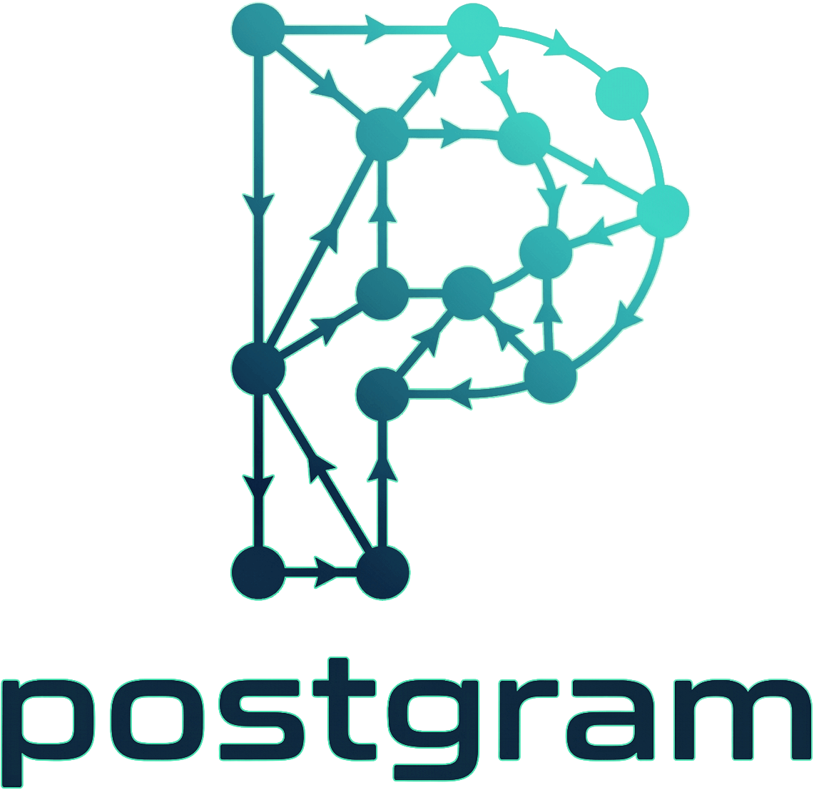

<p align="center">
    
  </p>

Postgram is a self-hosted knowledge store for humans and agents. It gives you a
single place to store memories, notes, people, projects, and tasks, then
retrieve them over REST, MCP, and a CLI with semantic search and API-key-based
access control.

## What It Is

Postgram is a personal-scale knowledge backend built for:

- human operators who want a searchable external memory
- agent workflows that need durable shared context across sessions
- local or single-VM deployments where simplicity matters more than massive scale

It is not a general SaaS platform. It is designed for one user or one small
team running their own instance.

## What It Does

Postgram provides:

- durable storage for typed entities: `memory`, `person`, `project`, `task`,
  `interaction`, `document`
- hybrid BM25 + vector search with async enrichment and BM25-only fallback
- knowledge graph with typed directional edges between entities
- LLM-powered relationship extraction (OpenAI, Anthropic, or Ollama)
- document sync from local markdown repos via manifest comparison
- scoped API-key authentication and visibility restrictions
- a REST API for application and automation access
- an MCP SSE endpoint for agent-native tool access
- a human CLI (`pgm`)
- a container-local admin CLI (`pgm-admin`)
- Talon SQLite migration tooling
- encrypted backup support
- append-only audit logging for mutating and privileged operations

## Architecture

Postgram is a TypeScript Node.js application built around a service layer.

Main components:

- PostgreSQL + `pgvector` for persistence and vector search
- Hono for the HTTP server
- MCP over SSE for agent-facing tool access
- CLI/admin CLIs built with Commander
- background enrichment worker for chunking, embeddings, and LLM extraction

High-level flow:

1. a client stores or updates an entity
2. the entity is written immediately
3. enrichment runs asynchronously: chunking, embedding, and optionally LLM extraction
4. chunks and embeddings are produced in the background
5. edges are created from extracted relationships (if extraction is enabled)
6. search queries use hybrid BM25 + vector scoring, with optional graph expansion

## Main Features

### 1. Typed Knowledge Storage

Store structured knowledge objects with:

- `type` (memory, person, project, task, interaction, document)
- `content`
- `tags`
- `visibility` (personal, work, shared)
- `status`
- arbitrary JSON metadata

### 2. Async Enrichment

Entities with content are persisted first and enriched later. Each entity
tracks `enrichment_status`: `pending`, `completed`, or `failed`. Failed
entities are retried up to 3 times with a 5-minute backoff.

### 3. Hybrid Search

Search blends vector cosine similarity (60%) with BM25 keyword ranking (40%)
transparently. When the embedding service is unavailable, search falls back to
BM25-only mode. Results include:

- ranked results with blended scores
- similarity scores
- recency-adjusted scores
- matching chunk text
- optional 1-hop graph neighbors (`expand_graph` parameter)

### 4. Knowledge Graph

Entities can be connected by typed directional edges:

- relation types: `involves`, `assigned_to`, `part_of`, `blocked_by`,
  `mentioned_in`, `related_to`, or any custom type
- edges have a confidence score (1.0 for manual, LLM-assigned for extracted)
- graph traversal via `expand` with configurable depth (1-3 hops)
- duplicate edge prevention via `UNIQUE(source_id, target_id, relation)`
- edges are created manually via `link`/`unlink` or automatically by the
  LLM extraction pipeline

### 5. LLM Extraction

When enabled, the enrichment worker extracts relationships from entity content
using an LLM. Extracted entity names are matched against existing entities and
edges are created automatically.

Supported providers:

| Provider  | Model default               | Env vars required                                     |
| --------- | --------------------------- | ----------------------------------------------------- |
| OpenAI    | `gpt-4o-mini`               | `OPENAI_API_KEY`                                      |
| Anthropic | `claude-haiku-4-5-20251001` | `ANTHROPIC_API_KEY`                                   |
| Ollama    | `llama3.2`                  | `OLLAMA_BASE_URL` (default: `http://localhost:11434`) |

### 6. Document Sync

Sync local directories of markdown files into postgram:

```bash
pgm sync ~/Documents/personal-notes
pgm sync ~/Documents/cf-notes --repo cf-notes --quiet
```

The CLI walks the directory for `.md` files, computes SHA-256 hashes, and sends
a full manifest to the server. The server diffs against stored state and
creates, updates, or archives document entities. Supports `--dry-run` and cron
scheduling.

### 7. Access Control

API keys can be restricted by:

- scopes: `read`, `write`, `delete`, `sync`
- allowed entity types
- allowed visibility levels

### 8. Task Management

Tasks are first-class entities with convenience operations for:

- create (with GTD context and due dates)
- list (filtered by status and context)
- update
- complete (with completion timestamp)

### 9. Multiple Interfaces

The same service layer is exposed through:

- REST API
- MCP SSE endpoint
- `pgm` CLI
- `pgm-admin` CLI

## Repository Layout

```text
src/
  auth/            API key validation and auth middleware
  cli/             Human CLI and admin CLI
  db/              Pool and migrations
  migrate-talon/   Talon import path
  services/        Business logic (entities, search, edges, sync, extraction)
  transport/       REST and MCP adapters
  types/           Shared types
  util/            Errors, audit, logging

tests/
  contract/        REST and MCP contract tests
  integration/     Service and CLI integration tests
  unit/            Pure logic tests
```

## Prerequisites

- Node.js 22+
- Docker + Docker Compose
- OpenAI API key (for embeddings)
- `gpg` (for encrypted backups)

Optional:

- Anthropic API key (for LLM extraction)
- Ollama (for local LLM extraction)

## Setup

### 1. Install dependencies

```bash
npm install
```

### 2. Create environment file

```bash
cp .env.example .env
```

Set:

```bash
POSTGRES_PASSWORD=postgram
OPENAI_API_KEY=<your-openai-key>
LOG_LEVEL=info
PORT=3100
```

### 3. Start the stack

```bash
docker compose up -d --build
```

The default compose setup exposes only the app on `127.0.0.1:3100`. PostgreSQL
stays on the internal Docker network.

### 4. Check health

```bash
curl http://127.0.0.1:3100/health
```

Expected:

- `status: "ok"`
- `postgres: "connected"`

## Environment Variables

### Server

| Variable                      | Required    | Default | Description                                                                                                                    |
| ----------------------------- | ----------- | ------- | ------------------------------------------------------------------------------------------------------------------------------ |
| `DATABASE_URL`                | yes         |         | Full Postgres connection string                                                                                                |
| `OPENAI_API_KEY`              | conditional |         | Required when `EMBEDDING_PROVIDER=openai` OR (`EXTRACTION_ENABLED=true` AND `EXTRACTION_PROVIDER=openai`). Optional otherwise. |
| `PORT`                        | no          | `3100`  | HTTP/MCP server port                                                                                                           |
| `LOG_LEVEL`                   | no          | `info`  | pino log level                                                                                                                 |
| `ENRICHMENT_POLL_INTERVAL_MS` | no          | `1000`  | Enrichment worker poll interval                                                                                                |

### Embeddings

| Variable               | Required             | Default                         | Description                                                                                                               |
| ---------------------- | -------------------- | ------------------------------- | ------------------------------------------------------------------------------------------------------------------------- |
| `EMBEDDING_PROVIDER`   | no                   | `openai`                        | `openai` or `ollama`                                                                                                      |
| `EMBEDDING_MODEL`      | no                   | per-provider                    | Defaults: `text-embedding-3-small` (openai, 1536 dims), `bge-m3` (ollama, 1024 dims)                                      |
| `EMBEDDING_DIMENSIONS` | no                   | per-provider                    | Must match the active `embedding_models` row. Run `pgm-admin embeddings migrate --target-dimensions <N> --yes` to change. |
| `EMBEDDING_BASE_URL`   | when provider=ollama | falls back to `OLLAMA_BASE_URL` | Embedding host. Independent from LLM-extraction host so embeddings and inference can target different machines.           |
| `EMBEDDING_API_KEY`    | no                   |                                 | Optional bearer token for `EMBEDDING_BASE_URL`.                                                                           |

See [`specs/002-local-embeddings/quickstart.md`](specs/002-local-embeddings/quickstart.md) for a walkthrough of fresh-install-on-Ollama and migrating from OpenAI.

### LLM Extraction

| Variable              | Required                | Default                  | Description                                                                                                       |
| --------------------- | ----------------------- | ------------------------ | ----------------------------------------------------------------------------------------------------------------- |
| `EXTRACTION_ENABLED`  | no                      | `false`                  | Enable LLM relationship extraction                                                                                |
| `EXTRACTION_PROVIDER` | no                      | `openai`                 | LLM provider: `openai`, `anthropic`, or `ollama`                                                                  |
| `EXTRACTION_MODEL`    | no                      | per-provider             | Model name (defaults: `gpt-4o-mini` for OpenAI, `claude-haiku-4-5-20251001` for Anthropic, `llama3.2` for Ollama) |
| `ANTHROPIC_API_KEY`   | when provider=anthropic |                          | Anthropic API key                                                                                                 |
| `OLLAMA_BASE_URL`     | no                      | `http://localhost:11434` | Ollama server URL                                                                                                 |

### CLI

| Variable      | Required | Description                |
| ------------- | -------- | -------------------------- |
| `PGM_API_URL` | yes      | Server URL                 |
| `PGM_API_KEY` | yes      | API key for authentication |

### Admin CLI

| Variable       | Required | Description                               |
| -------------- | -------- | ----------------------------------------- |
| `DATABASE_URL` | yes      | Direct DB connection for admin operations |

### Backup

| Variable                             | Required               | Description               |
| ------------------------------------ | ---------------------- | ------------------------- |
| `DATABASE_URL` or `PGM_DATABASE_URL` | yes                    | Database connection       |
| `PGM_BACKUP_PASSPHRASE`              | when using `--encrypt` | GPG encryption passphrase |

## Running The Server

### Pre-built Docker image (recommended)

Pull from GitHub Container Registry:

```bash
docker pull ghcr.io/ivo-toby/postgram:latest
```

Images are multi-arch (`linux/amd64`, `linux/arm64`). Tags available:

- `latest` — most recent build of `main`
- `main` — same as `latest`, explicit branch name
- `sha-<short>` — pinned to a specific commit
- `v<major>.<minor>.<patch>` — semver tags when a release is cut

The `docker-compose.yml` in this repo builds locally by default; to use the
pre-built image instead, replace `build: .` with `image: ghcr.io/ivo-toby/postgram:latest`
for the `mcp-server` service.

### Local development

```bash
npm run dev
```

Production-style local run:

```bash
npm run build
npm start
```

The server exposes:

- REST API at `http://127.0.0.1:3100/api`
- MCP endpoint at `http://127.0.0.1:3100/mcp`
- Health endpoint at `http://127.0.0.1:3100/health`

## Authentication

Create an API key (using the `bin/pgm` wrapper; see [Admin CLI](#admin-cli-pgm-admin) below for details):

```bash
./bin/pgm key create \
  --name local \
  --scopes read,write,delete \
  --visibility personal,work,shared \
  --json
```

Export it for CLI use:

```bash
export PGM_API_URL=http://127.0.0.1:3100
export PGM_API_KEY='<plaintext-key>'
```

## REST API Overview

### Entity endpoints

- `POST /api/entities` — store entity
- `GET /api/entities/:id` — recall entity
- `PATCH /api/entities/:id` — update entity
- `DELETE /api/entities/:id` — soft-delete entity
- `GET /api/entities` — list entities

### Search

- `POST /api/search` — hybrid BM25+vector search (supports `expand_graph`)

### Tasks

- `POST /api/tasks` — create task
- `GET /api/tasks` — list tasks
- `PATCH /api/tasks/:id` — update task
- `POST /api/tasks/:id/complete` — complete task

### Document sync

- `POST /api/sync` — push file manifest
- `GET /api/sync/status/:repo` — get sync status

### Knowledge graph

- `POST /api/edges` — create edge
- `DELETE /api/edges/:id` — delete edge
- `GET /api/entities/:id/edges` — list edges for entity
- `GET /api/entities/:id/graph` — expand graph neighborhood

All `/api/*` routes require `Authorization: Bearer <api-key>`.

## MCP Overview

MCP is served over SSE at:

```text
http://127.0.0.1:3100/mcp
```

Exposed tools:

- `store`, `recall`, `search`, `update`, `delete`
- `task_create`, `task_list`, `task_update`, `task_complete`
- `sync_push`, `sync_status`
- `link`, `unlink`, `expand`

The MCP tool behavior is intentionally aligned with the REST surface.

## Human CLI (`pgm`)

### Install from npm

```bash
npm install -g @ivotoby/postgram-cli
```

Then configure once:

```bash
export PGM_API_URL=http://<postgram-host>:3100
export PGM_API_KEY=<your-api-key>
# or persist them in ~/.pgmrc as JSON: { "api_url": "...", "api_key": "..." }
```

### Run from source (for development)

```bash
npx tsx src/cli/pgm.ts <command>
```

### Entity commands

```bash
pgm store "decided to use pgvector" --type memory --tags decisions
pgm search "database decisions"
pgm search "database decisions" --type memory          # filter by entity type
pgm search "who worked on embeddings" --expand-graph   # include graph neighbours
pgm recall <id>
pgm list --type memory
pgm update <id> --content "updated text" --version 1
pgm delete <id>
```

### Task commands

```bash
pgm task add "set up monitoring" --context @focus-work --status next
pgm task list --status next
pgm task update <id> --status waiting --version 1
pgm task complete <id> --version 2
```

### Document sync

```bash
pgm sync ~/Documents/personal-notes
pgm sync ~/Documents/cf-notes --repo cf-notes --dry-run
pgm sync ~/Documents/personal-notes --quiet  # for cron
```

### Knowledge graph

```bash
pgm link <source-id> <target-id> --relation involves
pgm expand <entity-id> --depth 2
pgm unlink <edge-id>
```

### Backup

```bash
pgm backup --encrypt --output /tmp/postgram-backups/
```

## Admin CLI (`pgm-admin`)

The easy way — use the `bin/pgm` wrapper shipped in the repo. It runs
`pgm-admin` via `docker exec` when the container is up, and falls back to
`docker compose run --rm` when it isn't (useful for first-boot migrations
or when the startup dimension gate is refusing to boot):

```bash
./bin/pgm <command> [args...]
```

Examples:

```bash
./bin/pgm key create --name local --scopes read,write,delete --visibility personal,work,shared
./bin/pgm stats
./bin/pgm embeddings migrate --target-dimensions 1024 --dry-run
./bin/pgm embeddings migrate --target-dimensions 1024 --yes
```

Shell alias for daily use (add to `~/.bashrc` or `~/.zshrc` on your docker
host):

```bash
alias pgm='/var/lib/docker/configs/postgram/bin/pgm'
# then just: pgm stats
```

Override with env if your service/container names differ:

```bash
PGM_SERVICE=mcp-server PGM_CONTAINER=postgram-mcp-server-1 ./bin/pgm stats
```

Direct equivalent without the wrapper (for reference):

```bash
docker compose exec -T mcp-server pgm-admin <command>
# or, when the container is down:
docker compose run --rm mcp-server pgm-admin <command>
```

Main commands:

- `key create`, `key list`, `key revoke`
- `audit` — query audit logs
- `model list`, `model set-active`
- `reembed --all` — mark entities for re-embedding
- `stats` — entity counts, chunk count, DB size
- `embeddings migrate` — switch embedding dimensions (see [`specs/002-local-embeddings/quickstart.md`](specs/002-local-embeddings/quickstart.md))

## Talon Migration

```bash
docker cp /path/to/talon.sqlite postgram-mcp-server-1:/tmp/talon.sqlite

docker compose exec -T mcp-server \
  node dist/migrate-talon/index.js /tmp/talon.sqlite \
  --api-base-url http://127.0.0.1:3100 \
  --api-key "$PGM_API_KEY"
```

Useful flags: `--dry-run`, `--thread <id>`, `--batch-size <n>`, `--skip-embeddings`

## Testing

```bash
npm test            # all tests
npm run lint        # eslint
npm run build       # typecheck
npm run test:coverage
```

Targeted suites:

```bash
npx vitest run tests/unit/
npx vitest run tests/integration/
npx vitest run tests/contract/
```

## Current Status

Implemented phases:

- **Phase 1 MVP:** Entity CRUD, hybrid search, API key auth, enrichment worker,
  REST + MCP + CLI, Talon migration, backup, audit logging
- **Phase 1 Enhancements:** BM25+vector hybrid search, enrichment retry with
  backoff, `pgm-admin reembed`, `pgm list`, startup validation
- **Phase 2 Document Sync:** Push-based markdown sync with SHA-256 change detection,
  `pgm sync` CLI, REST + MCP sync tools
- **Phase 3 Knowledge Graph:** Edges table, `link`/`unlink`/`expand` tools,
  LLM extraction pipeline (OpenAI/Anthropic/Ollama), graph-enhanced search

## Notes And Limitations

- Postgram is optimized for personal/small-team scale
- Embeddings default to OpenAI (`text-embedding-3-small`) but can run fully
  locally via Ollama — set `EMBEDDING_PROVIDER=ollama`
- LLM extraction is optional and disabled by default
- Backup encryption requires `gpg`

## Claude Code skill

A portable Claude Code skill for using `pgm` from your own agent lives in
[`skill/postgram/SKILL.md`](skill/postgram/SKILL.md). Copy the `skill/postgram/`
directory into your own project's `.claude/skills/` (or your user-level
`~/.claude/skills/`) and the agent will know when to invoke `pgm store`,
`pgm search`, `pgm link`, etc. It assumes the CLI is on PATH and
`PGM_API_URL` + `PGM_API_KEY` are set. The skill file is deliberately _not_
under `.claude/` in this repo so you can decide where to put it.

### Optimising your global CLAUDE.md

To get the most out of Postgram across sessions, add Postgram-aware guidance to
your global `~/.claude/CLAUDE.md`. A ready-to-use template is provided at
[`templates/CLAUDE.md`](templates/CLAUDE.md) — it covers when to search (with
type filters), when to use `expand_graph`, when to store, when to link, and
general principles. Copy the relevant sections into your own `CLAUDE.md` and
Claude will proactively use the MCP tools to persist and recall knowledge
without being asked.

## Releases & CI

The CLI package publishes to npm as
[`@ivotoby/postgram-cli`](https://www.npmjs.com/package/@ivotoby/postgram-cli)
on every merge to `main`, driven by [semantic-release](https://semantic-release.gitbook.io/)
v25 and conventional commits scoped to `cli` (e.g. `feat(cli): ...`).
Non-CLI-scoped commits don't bump the CLI version. Workflow:
[`.github/workflows/release-cli.yml`](.github/workflows/release-cli.yml).

Publishing uses an npm **Automation token** stored as the `NPM_TOKEN`
repository secret. The `--provenance` flag is passed at publish time so every
release gets a Sigstore-signed provenance attestation regardless.

First-time setup:

1. On npmjs.com: Avatar → Access Tokens → Generate New Token → **Automation**
2. GitHub repo: Settings → Secrets and variables → Actions → New repository secret
   → name `NPM_TOKEN`, value: the token from step 1
3. Subsequent publishes happen automatically from the workflow.

The server's Docker image publishes to
`ghcr.io/ivo-toby/postgram` on every merge to `main` and on semver tag
pushes (multi-arch `amd64` + `arm64`). Workflow:
[`.github/workflows/docker.yml`](.github/workflows/docker.yml). Uses the
built-in `GITHUB_TOKEN`; no extra secret required, but repo `packages:write`
permission must be enabled.

## Related Docs

- [Phase 1 MVP spec](specs/001-phase1-mvp/spec.md)
- [Phase 1 enhancements design](docs/superpowers/specs/2026-03-30-phase1-enhancements-design.md)
- [Phase 2 document sync design](docs/superpowers/specs/2026-03-30-phase2-document-sync-design.md)
- [Phase 3 knowledge graph design](docs/superpowers/specs/2026-03-30-phase3-knowledge-graph-design.md)
- [Phase 4 local embeddings spec](specs/002-local-embeddings/spec.md)
- [Manual test plan](docs/manual-test-plan.md)
